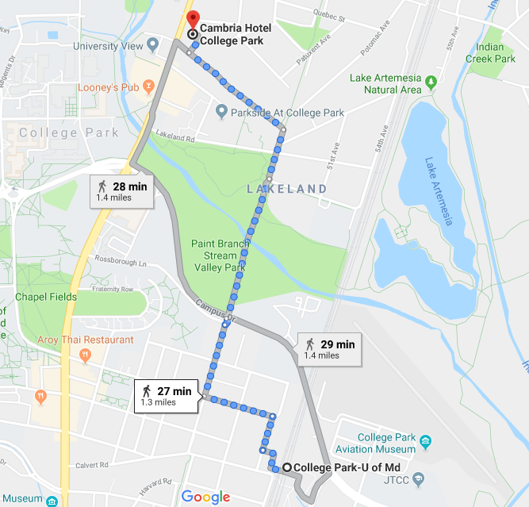

### Workshop location
Physical Sciences Complex, Room PSC 1136  
University of Maryland  
College Park, MD

### Lodging
We have a room block at the Cambria Hotel for $129/night. Reserve at https://www.choicehotels.com/reservations/groups/IB67L9 or calling 301-595-2600 and mentioning the Caltech room block.

### Walking from Cambria Hotel to PSC 
It's a short walk from the hotel to the Physical Sciences Complex:

### Dining 
College Park is a college town; you do not lack for choices in places to eat! For “Maryland-style” pizza, the place to go is The Original Ledo Restaurant (Ledo’s to locals); this pizza is consistently rated the best in the DC area and is what people who moved away want to eat when visiting the area. See the [Dining PDF](https://github.com/ASCLnet/SWRegistryWorkshop/blob/master/CollegeParkDining.pdf) for details. 

**In the PSC**  
Quantum Café: Quick grab-and-go sandwiches, salads, muffins, coffee, etc., 1st floor in lobby

**In Stamp Student Union (up the hill from PSC)**  
Chick-fil-A &nbsp;|&nbsp; Hibachi San &nbsp;|&nbsp; Maryland Dairy &nbsp;|&nbsp; McDonald's  
Moby Dick &nbsp;|&nbsp; Panda Express &nbsp;|&nbsp; Saladworks &nbsp;|&nbsp; Sbarro  
Subway &nbsp;|&nbsp; The Coffee Bar  

**In the Cambria**  
College Park Grill: Steaks, seafood, wood-fired pizza, 301-474-4745, http://www.collegeparkgrill.com  

**One block south** *(west side of Baltimore Avenue)*  
SweetGreen: Salads, 240-770-4443, https://www.sweetgreen.com/  
Shanghai Tokyo Cafe: Pan Asian, 301-220-1998 http://www.shanghaitokyocafemd.com/  

**Two blocks south** *(west side of Baltimore Avenue)*  
Vigilante Coffee: Café, 301-200-3110, 8200 Baltimore Avenue, http://vigilantecoffee.com   
Board & Brew: Café, 240-542-4613, https://www.theboardandbrew.com/  
Looney’s Pub: Pub, 240-542-4510, https://looneyspubmd.com/  
Bobby’s Burger Palace: Hamburgers, 240-542-4702,
http://bobbysburgerpalace.com/locations/5/university-of-maryland  
NuVegan Cafe: Vegan comfort/soul food, 240-553-7625, http://www.ilovenuvegan.com/  

**Two blocks south** *(east side of Baltimore Avenue)*  
*Campus Village Shoppes*  
Pho D’Lite: Vietnamese Pho, 301-982-9899, http://phodlite.com   
Food Factory: Middle Eastern & Indian, 301-345-8888, http://www.foodfactorybaltimore.com   
Pupuseria La Familiar: El Salvadoran, 301-474-8484, http://pupuserialafamiliar.com/  
DP Dough: Pizza, calzones, etc., 301-614-9663, https://dpdough.com  
Hanami: Japanese, 301-982-9899, http://www.hanamijapanese.com/  

Many more places to eat in the area ([PDF](https://github.com/ASCLnet/SWRegistryWorkshop/blob/master/CollegeParkDining.pdf))

### Travel
College Park is a short Metro ride from the myriad attractions of downtown Washington and easily reached from three major airports that serve the Baltimore-Washington, DC area. 

#### Getting to and from major airports
The quickest method is often by Uber or Lyft ($40+ depending on time of day). You can also book a SuperShuttle shared ride in advance. If you wish to use public transportation, here are directions for each airport:

**From Dulles (IAD)**: Use the Silver Line Express Bus to Wiehle-Reston East Metro Station. From there, take the Metro SILVER Line to L'Enfant Plaza Metro Station; at the L’Enfant Plaza Metro Station, change to the GREEN line to College Park Metro Station. From there, you can walk just over 1 mile (see map below) to the Cambria or take a taxi or Uber/Lyft. If walking, be sure to walk through the tunnel to the _neighborhood_ side of the tracks.

**From Baltimore/Washington (BWI)**: Use BWI Express Metro bus service to Greenbelt Metro Station. Then take the GREEN line one stop to College Park Metro Station. From there, you can walk just over 1 mile (see map below) to the Cambria or take a taxi or Uber/Lyft. If walking, be sure to walk through the tunnel to the _neighborhood_ side of the tracks.

**From Ronald Reagan (DCA)**: Take the Metro YELLOW line from the airport to L'Enfant Plaza Metro Station; at the L’Enfant Plaza Metro Station, change to the GREEN line to College Park Metro Station. From there, you can walk just over 1 mile (see map below) to the Cambria or take a taxi or Uber/Lyft. If walking, be sure to walk through the tunnel to the _neighborhood_ side of the tracks.

The Cambria Hotel is located just over a mile from the College Park Metro station, which is on Metro's Green Line. Taxi service is available at the College Park Metro station. The walk from the Metro to the Cambria is mostly flat, with a slight incline before reaching the hotel.  

#### Traveling in College Park  
For getting around locally, consider a pedal bicycle, e-bicycle, or e-scooter: VeoRide has partnered with U of MD, City of College Park, and Town of University Park to provide these transportation options throughout the area. 

[Info For New Metro Riders](https://www.wmata.com/rider-guide/new-riders/)  
[Metro System Map (PDF)](https://www.wmata.com/schedules/maps/upload/2017-System-Map.pdf)  
[Ronald Reagan National Airport (DCA)](http://www.flyreagan.com/dca/reagan-national-airport); 17 miles  
[Baltimore/Washington International Airport (BWI)](http://www.bwiairport.com/); 27 miles  
[Washington Dulles International Airport (IAD)](http://www.flydulles.com/); 36 miles  
[VeoRide](https://transportation.umd.edu/sustainable-transportation/bikeumd/veoride-umd-faqs)  

  &nbsp; &nbsp;   
  &nbsp; &nbsp;    
  &nbsp; &nbsp;    
  &nbsp; &nbsp;  
##### [Main page](https://asclnet.github.io/SWRegistryWorkshop/) | [Agenda](https://asclnet.github.io/SWRegistryWorkshop/Agenda.html) | [Participants](https://asclnet.github.io/SWRegistryWorkshop/Participants.html)   

