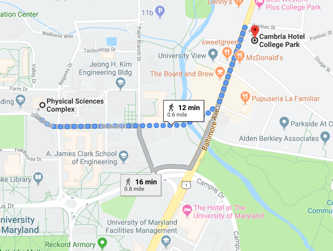

### Workshop location
Physical Sciences Complex, Room PSC 1136  
University of Maryland  
College Park, MD

### Lodging
We have a room block at the Cambria Hotel for $129/night. Reserve at https://www.choicehotels.com/reservations/groups/IB67L9 or calling 301-595-2600 and mentioning the Caltech room block.

### Walking from Cambria Hotel to PSC 
It's a short walk from the hotel to the Physical Sciences Complex:

### Travel
College Park is a short Metro ride from the myriad attractions of downtown Washington and easily reached from three major airports that serve the Baltimore-Washington, DC area. 

#### Getting to and from major airports
The quickest method is often by Uber or Lyft ($40+ depending on time of day). You can also book a SuperShuttle shared ride in advance. If you wish to use public transportation, here are directions for each airport:

**From Dulles (IAD)**: Use the Silver Line Express Bus to Wiehle-Reston East Metro Station. From there, take the Metro SILVER Line to L'Enfant Plaza Metro Station; at the L’Enfant Plaza Metro Station, change to the GREEN line to College Park Metro Station. From there, you can walk 1 mile (see "A to B" walking route on map below) to the Cambria or take a taxi or Uber/Lyft. If walking, be sure to walk through the tunnel to the _neighborhood_ side of the tracks.

**From Baltimore/Washington (BWI)**: Use BWI Express Metro bus service to Greenbelt Metro Station. Then take the GREEN line one stop to College Park Metro Station. From there, you can walk 1 mile (see "A to B" walking route on map below) to the Cambria or take a taxi or Uber/Lyft. If walking, be sure to walk through the tunnel to the _neighborhood_ side of the tracks.

**From Ronald Reagan (DCA)**: Take the Metro YELLOW line from the airport to L'Enfant Plaza Metro Station; at the L’Enfant Plaza Metro Station, change to the GREEN line to College Park Metro Station. From there, you can walk 1 mile along (see "A to B" walking route on map here) to  the Cambria or take a taxi or Uber/Lyft. If walking, be sure to walk through the tunnel to the _neighborhood_ side of the tracks.

The Cambria Hotel is located one mile from the College Park Metro station, which is on Metro's Green Line. Taxi service is available at the College Park Metro station. The walk from the Metro to the Cambria is mostly flat, with a slight incline before reaching the hotel.

#### Traveling in College Park
For getting around locally, consider a bicycle: Zagster BikeShare has partnered with U of MD and The City of College Park to provide bikeshare stations throughout the area. 

[Info For New Metro Riders](https://www.wmata.com/rider-guide/new-riders/)  
[Metro System Map (PDF)](https://www.wmata.com/schedules/maps/upload/2017-System-Map.pdf)  
[Ronald Reagan National Airport (DCA)](http://www.flyreagan.com/dca/reagan-national-airport); 17 miles  
[Baltimore/Washington International Airport (BWI)](http://www.bwiairport.com/); 27 miles  
[Washington Dulles International Airport (IAD)](http://www.flydulles.com/); 36 miles  
[Zagster BikeShare Stations](https://bike.zagster.com/mbike)  
