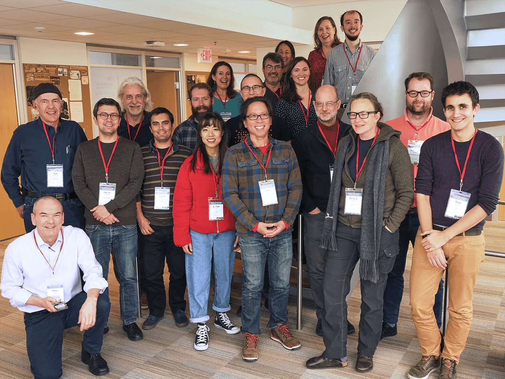
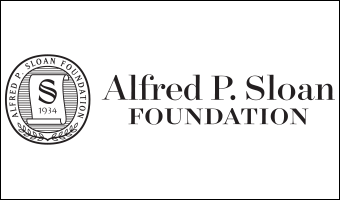

### Dates and location
#### Nov. 13-14, 2019 &#9830; University of Maryland, College Park &#9830; Physical Sciences Complex Room 1136
#### Twitter: #scicodes  

### Purpose

This two-day workshop for editors and maintainers of academic discipline and institutional software registries and repositories brings those who run these services together to continue work started in conference calls earlier this year. We feel there is substantial benefit in sharing our work methods, marketing ideas, and communication practices, as doing so can speed improvements to each of the respective services, making them more efficient and better able to meet the needs of their disciplines. This workshop's goals are to demonstrate unique aspects of our respective services, discuss challenges and share solutions to common issues that arise in managing our resources, finalize a list of best practices for our resources, and work cooperatively to speed adoption of the CodeMeta and/or CFF standards. A software developer knowledgeable about CodeMeta and CFF will be available at the workshop and in the weeks following to assist those software services editors and managers who want to implement the production of these files for their holdings.

This workshop is the first effort focused specifically on and for discipline-specific software registries and repositories and leverages other ongoing efforts to improve software citation, including the work of the [FORCE11 Software Citation Implementation Working Group](https://github.com/force11/force11-sciwg), [Working toward Sustainable Software for Science: Practice and Experience (WSSSPE)](http://wssspe.researchcomputing.org.uk/), and the [CodeMeta](https://codemeta.github.io/) and [Citation File Format](https://citation-file-format.github.io/) projects.

<a href="assets/media/ssrcw-group-photo-2019-11-14-medium.png">[Larger photo]</a>
&nbsp;&nbsp;
<a href="assets/media/ssrcw-group-photo-2019-11-14-full.png">[Full-sized photo]</a>
 
<strong><a href="https://mikehucka.smugmug.com/Work/Software-meetings/SSRCW-2019/">&rarr; View the complete photo album on SmugMug &larr;</a></strong>

### Organizers
- [Alice Allen, ASCL/UMD](http://ascl.net/wordpress/about-ascl/people/alice_allen/), aallen@ascl.net
- [Tom Morrell, Caltech](https://www.library.caltech.edu/person/tom-morrell)
- [Michael Hucka, Caltech](http://www.cds.caltech.edu/~mhucka/)
- [Stephen Davison, Caltech](https://www.library.caltech.edu/person/stephen-davison)

### [Agenda](Agenda.md)

### [Remote access](RemoteAccess.md)

### [Logistics](Logistics.md)  

### [Participants](Participants.md)

### [Links for workshop activities](ActivitiesLinks.md)

### [Workshop and presentation slides](https://github.com/ASCLnet/SWRegistryWorkshop/tree/master/presentations)  

### [Workshop evaluation](https://forms.gle/ksjx6o6pNkbS8gsSA)  

### [Workshop products and results](Products/Products.md)

### [Photo album](https://mikehucka.smugmug.com/Work/Software-meetings/SSRCW-2019/)  

### Funding  
This workshop is made possible by support from the [Alfred P. Sloan Foundation](https://sloan.org/); we are grateful for their support.   

